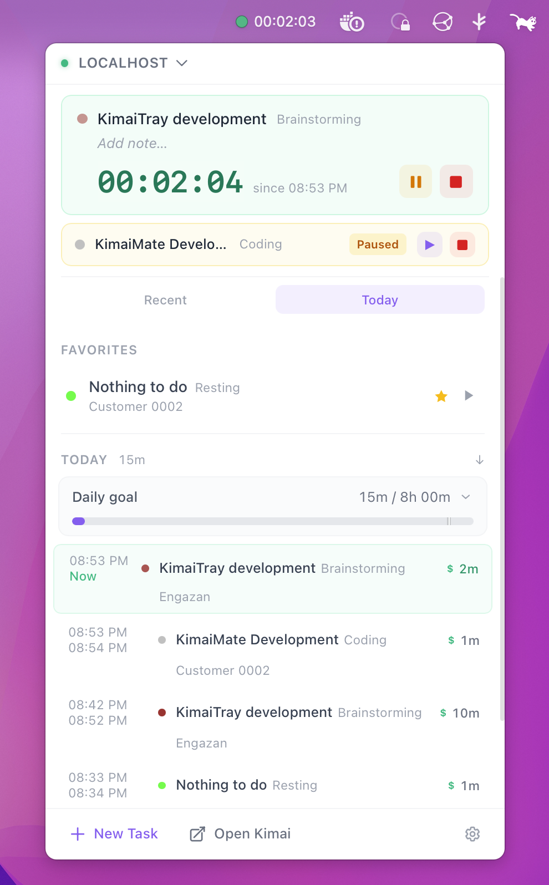
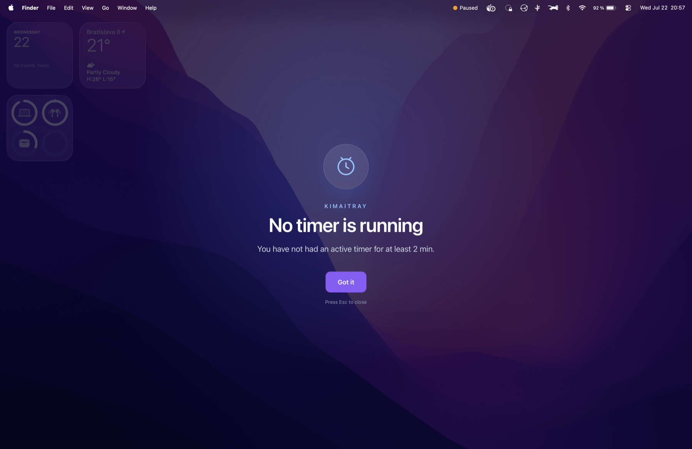

<div align="center">

# KimaiTray

A system tray companion for [Kimai](https://www.kimai.org/) time tracking. Start, stop, pause and switch timers without leaving your desktop.

[](https://github.com/Engazan/KimaiTray/releases)
[](#license)


### ⬇️ [**Download the latest release**](https://github.com/Engazan/KimaiTray/releases)



</div>

Built with [Tauri 2](https://tauri.app/), React 19 and TypeScript.

## Features

### Time tracking

- Start, stop and switch Kimai timers directly from the tray popup
- Pause multiple timers, resume any of them later or discard them
- Optionally reveal paused-timer descriptions on hover
- Quick-start tasks from per-connection favorites and recent entries
- Searchable project, activity, customer and Kimai tag pickers with on-demand refresh
- Optional notes, tags, customer filtering and a custom start time for new tasks
- Edit the active timer's note, tags and start time
- Edit the start and end time of completed entries when permitted by the Kimai API
- Hide recent tasks locally or delete their time entries from Kimai
- Today's time-entry timeline with sorting, durations, colors and billable status
- Optional per-connection daily goals with required/full milestones, remaining time and an estimated finish time
- Optional Category Mode with a configurable two-level activity tree, icons, colors, import/export and hourly remote synchronization

### Issue tracker integrations

- GitLab, GitHub and Gitea issue linking, configured independently for each Kimai connection
- Browse and search accessible projects/repositories and select a repository per timer
- Filter issues by state, assignee and included or excluded labels
- Highlight and preselect issues matching the chosen Kimai project
- Open or copy issue links and optionally insert an issue URL or title into the timer description
- GitLab spent/estimated-time badges in the issue picker and active timer
- Sync recorded time back to linked GitLab and Gitea issues when a timer stops

### Automation and reminders

- Configurable global shortcuts for the popup, new task, stop, pause/resume, continue last task, edit note, open Kimai and Settings
- Idle detection with configurable threshold and actions: ask, stop at idle start, stop now or keep running
- Full-screen idle prompt and optional desktop notification
- Configurable full-screen reminder when no timer has been running
- Launch at login, configurable server refresh interval and one-click opening of Kimai
- Automatic updates, manual update checks and a localized What's New screen after updates

### Connections and security

- Multiple isolated Kimai connections, including separate accounts on the same server
- Per-connection favorites, paused timers, feature settings, caches and issue integrations
- API and integration credentials stored in the operating system's secure credential store
- Native HTTP broker with validated origins and pinned DNS targets for Kimai and issue-tracker requests

### Appearance and desktop integration

- Four popup layouts: Classic, Focus, Taskbar and Timeline
- Light, dark and transparent themes, five accent colors and configurable Kimai color indicators
- UI scaling from 85% to 160%, optional rounded corners, animations and translucency controls
- Tray or resizable detached-window mode; macOS True Tray mode hides the Dock and Cmd+Tab entry
- Custom tray icon shape, size and colors for running, paused, idle and error states
- Configurable macOS menu-bar label (timer, project, activity or icon only) and tray left/right-click actions
- Configurable popup monitor and placement on supported Linux/X11 desktops
- Five bundled languages: English, Slovak, Czech, German and Ukrainian, plus system-language detection
- Native support for macOS, Windows and Linux, including X11 and supported Wayland desktops

## Full-screen reminders

The optional no-timer and idle reminders can take over the screen so they are difficult to miss.



## Prerequisites

| Tool | Version |
|------|---------|
| [Node.js](https://nodejs.org/) | 20.19+ |
| [Rust](https://rustup.rs/) | stable |
| [Tauri CLI](https://tauri.app/start/) | Installed locally by `npm install` |

### Platform-specific

**macOS** — Xcode Command Line Tools:
```sh
xcode-select --install
```

**Linux (Debian/Ubuntu)**:
```sh
sudo apt install libwebkit2gtk-4.1-dev libappindicator3-dev librsvg2-dev patchelf
```

**Windows** — [Visual Studio Build Tools](https://visualstudio.microsoft.com/visual-cpp-build-tools/) with "Desktop development with C++" workload. WebView2 is bundled automatically.

## Quick Start

```sh
git clone https://github.com/Engazan/KimaiTray.git
cd KimaiTray
npm install
npm run tauri dev
```

The tray icon appears in your menu bar / system tray. Click it to open the popup.

## Kimai API Token Setup

1. Log into your Kimai instance
2. Go to your profile (click your avatar) -> **API Access**
3. Click **Create** to generate a new API token
4. Copy the token
5. In KimaiTray, click the tray icon -> **Settings** -> **Connection**
6. Enter your Kimai URL (e.g. `https://kimai.example.com`) and paste the token
7. Click **Test & Save**

> Token permissions depend on your Kimai role. Admin or Team Lead roles provide full API access.

## Building for Production

```sh
# Build for the current platform
npm run tauri build

# Build frontend only (staging/production mode)
npm run build:staging
npm run build:prod
```

### Output locations

| Platform | Artifacts |
|----------|-----------|
| macOS | `src-tauri/target/release/bundle/dmg/` and `.app` |
| Windows | `src-tauri/target/release/bundle/nsis/` |
| Linux | `src-tauri/target/release/bundle/appimage/`, `deb/` |

## Environment Configuration

Three environment modes via Vite `.env.*` files:

| File | `VITE_ENV` | `VITE_LOG_LEVEL` |
|------|-----------|-----------------|
| `.env.development` | development | debug |
| `.env.staging` | staging | info |
| `.env.production` | production | warn |

Create `.env.local` or `.env.production.local` for machine-specific overrides (gitignored).

## Project Structure

```
src/                    # React frontend
  api/                  # Kimai REST API client
  categorymode/         # Configurable category-based timer workflow
  components/           # UI components
  hooks/                # Custom React hooks
  integrations/         # Issue tracker integrations
  providers/            # React context providers (React Query)
  settings/             # Settings UI & service
  windows/              # TrayPopup & Settings windows
  shared/i18n/          # Translations (5 languages)
  utils/                # Logger, time formatting
src-tauri/              # Tauri / Rust backend
  src/lib.rs            # App setup, plugin registration
  src/main.rs           # Binary entry point
  src/tray.rs           # System tray, icon generation
  src/shortcuts.rs      # Global keyboard shortcuts
  src/keychain.rs       # API token storage
  src/http.rs           # Bounded native HTTP broker
  src/idle.rs           # Platform idle detection
  tauri.conf.json       # App metadata & bundle config
  capabilities/         # Permission declarations
  icons/                # App icons (icns, ico, png)
```

## Logging

**Rust side**: Uses `tauri-plugin-log` — writes to stdout, log directory, and webview console.
- macOS logs: `~/Library/Logs/eu.engazan.kimaitray/`
- Linux logs: `~/.local/share/eu.engazan.kimaitray/logs/`
- Windows logs: `%APPDATA%/eu.engazan.kimaitray/logs/`

**Frontend**: Import `logger` from `src/utils/logger.ts`. Log level controlled by `VITE_LOG_LEVEL`.

```ts
import { logger } from "./utils/logger";
logger.info("Timer started");
```

## Auto-Updates

KimaiTray checks for updates on startup via GitHub Releases. When a new version is available, an update banner appears in the tray popup.

**Setup for CI signing** (one-time):

1. The signing keys are already generated. The public key is in `tauri.conf.json` -> `plugins.updater.pubkey`
2. Add the private key content (`src-tauri/signer.key`) as a GitHub Secret named `TAURI_SIGNING_PRIVATE_KEY`
3. If the key has a password, also add `TAURI_SIGNING_PRIVATE_KEY_PASSWORD`

The CI workflow automatically signs artifacts and generates `latest.json` on tagged releases.

**To regenerate keys** (invalidates all previous versions):
```sh
npx tauri signer generate -w ./src-tauri/signer.key --ci
```
Update the `pubkey` in `tauri.conf.json` with the new public key.

See the [Tauri Updater docs](https://tauri.app/plugin/updater/) for details.

## CI/CD

GitHub Actions workflow at `.github/workflows/build.yml`:

- Triggers on version tags (`v*`) and manual `workflow_dispatch` runs
- Cross-platform matrix: macOS (ARM + Intel), Linux, Windows
- On version tags (`v*`), creates a draft GitHub Release with all platform artifacts

To release (replace `X.Y.Z` with the version from `package.json`):
```sh
git tag vX.Y.Z
git push origin vX.Y.Z
```

Then review and publish the draft release on GitHub.

## Troubleshooting

**macOS: "app is damaged" or Gatekeeper warning**
Official release builds are signed and notarized. If macOS still quarantines a verified download, run:
```sh
xattr -cr /Applications/KimaiTray.app
```

**Linux: AppImage won't launch**
```sh
chmod +x KimaiTray_*.AppImage
```
If using Wayland, the tray icon may require an AppIndicator extension.

**Windows: WebView2 missing**
The NSIS installer bundles a WebView2 bootstrapper. If you built manually, install [WebView2 Runtime](https://developer.microsoft.com/en-us/microsoft-edge/webview2/).

**Connection fails with 401**
Your API token may have expired or lack permissions. Generate a new one in Kimai -> Profile -> API Access.

**Idle detection not working on Linux**
Idle detection uses `xprintidle` on X11 and the GNOME Mutter or KDE KIdleTime
D-Bus API on Wayland. Install `xprintidle` when using X11:
```sh
sudo apt install xprintidle
```

## License

[MIT](LICENSE)
